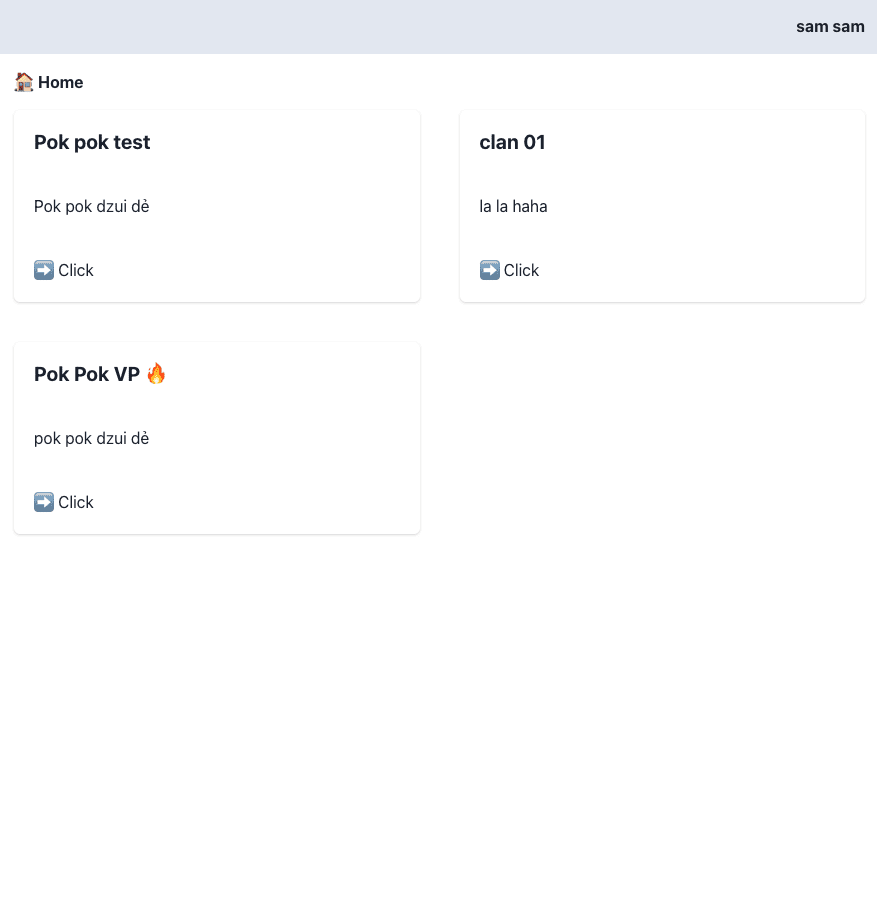
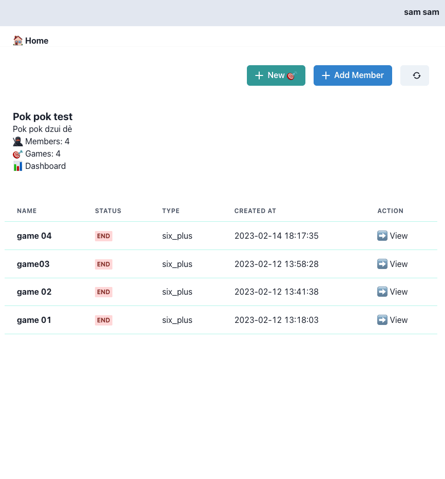
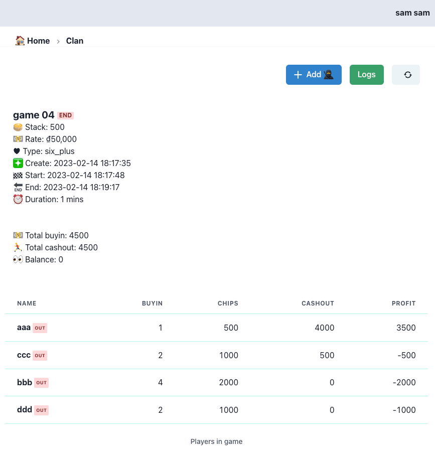
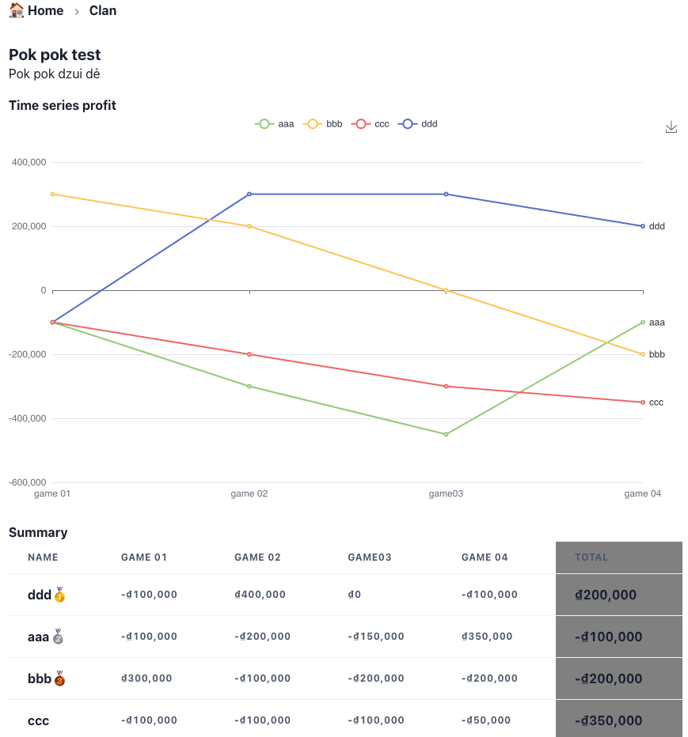

Pok Pok app

Check out repo:
- Backend https://github.com/chuongtrh/pokpok-api
- Web app https://github.com/chuongtrh/pokpok-app

Stacks:
- Web: Next.js, Charka-ui, PWA
- API: oak + denojs
- DB: firestore

## Getting Started

First, setup file **.env.local** from *.env.example* then run the development server:

```bash
npm run dev
# or
yarn dev
```
Open [http://localhost:3000](http://localhost:3000) with your browser to see the result.
## Deploy

Host web app into Firebase hosting.

Setup key *FIREBASE_SERVICE_ACCOUNT* in github action

## Features
- [x] Init api with deno using OAK => https://deno.land/x/oak@v11.1.0
- [x] Hot reload with denon https://deno.land/x/denon@2.5.0
- [x] Connect db firestore => https://deno.land/manual@v1.30.0/basics/connecting_to_databases#connect-to-firebase-with-the-firestore-npm-module
- [x] Implement logic app
- [x] Sent noti into telegram channel
- [x] Login with google
- [x] JWT token
- [x] Dashboard
- [x] Chart => https://echarts.apache.org/en/index.html
- [x] PWA https://github.com/shadowwalker/next-pwa


## Screenshot






## Author
chuongtrh@gmail.com
